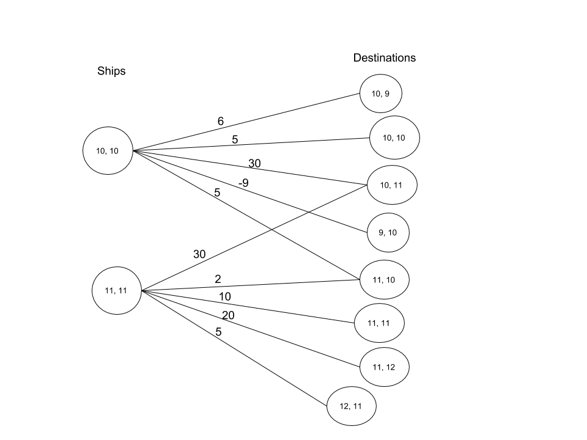

# CowZow Halite AI

This is my AI for the Halite 3 competition (https://halite.io/). It was [rank 13 out of 4014 competitors](https://2018.halite.io/programming-competition-leaderboard).

## Build Instructions

If you want to try playing around with my bot, I have included two versions of my bot in `bot_versions/`.
* stable.jar: This is the stable version of my bot.
* latest.jar: This contains a lot of experimental changes which are untested.

Also, if you would like to experiment with the code, this project is built with Maven.

* You can build my bot from the sources, by running `mvn package -DskipTests`. After running the command, the bot will be compiled into a jar and outputted to a generated target directory: `target/MyBot.jar`.

## Overview

The strategy of my bot is broken into two steps:

1. **Move Scoring:** For each ship, calculate a score for each direction of the ship `{NORTH, SOUTH, EAST, WEST, STILL}`.

2. **Move Resolution:** Resolve the moves by choosing moves that maximizes the sum of scores of
all moves taken by ships while not having collisions. This is achieved with the
[Hungarian Algorithm](https://en.wikipedia.org/wiki/Hungarian_algorithm).

### Move Scoring

For each ship, calculate the score of each direction the ship can move `{UP, DOWN, LEFT, RIGHT, STILL}`.
The factors of scoring each move are taken from the following categories:

- **Tile Score**: Every ship moves toward a tile which yields some amount of points.

  - Every ship is matched with a tile on the map that is considered a best-effort match to the ship. Additionally,
    every ship considers all the tiles within 4-units away from it. All of these tiles are scored for the ship, and the best
    scores from the tiles are saved into the `{UP, DOWN, LEFT, RIGHT, STILL}` move scores for each ship.

  - The points a tiles yields is calculated with `inspiredBonus * (haliteGained - tollFromTileToHome) / (turnsToGetToTile + turnsSpentOnTile)`.
    This is the essence of the tile scoring strategy with a few minor tweaks.

* **Return Home Score**: Every ship also has an option to return home. The score for returning home is calculated
using: `(magic_ratio) * (haliteOnShip - costToHome) / (turnsToGetHome + 4)`.

* **Enemy Influence Score**: This value is between [-1000, 0]. Each move might move a ship adjacent to an
enemy, this is either considered *bad* or *neutral*. Conditions in which it
is bad is if there is a larger enemy force near the tile and the destination tile is adjacent to an enemy.
A score of `0` is returned if the ship should just ignore enemies at this move.

* **Kill score**: For every enemy, calculate the direction(s) it must go in to return home. If one of my ships can
occupy the square that an enemy will take to go home (and my ship has much less halite than the enemy), occupy that square.

Finally, these scores are distilled down into one net score for each tile:
`Max(TileScore, ReturnHomeScore) + enemyInfluenceScore + killScore`

### Move Resolution

If you are able to come up with scores for each Directional move of your bot, i.e. like:

```
The way to read this table is:
If a ship moves in Direction X, it is worth N points.

Ship 1 at (10, 10):
* UP (10, 9)  = 6 points
* DOWN (10, 11) = 30 points
* EAST (11, 10) = 5 points
* WEST (9, 10) = -4 points
* STILL (10, 10) = 5 points

Ship 2 at (11, 11):
* UP (11, 10)  = 2 points
* DOWN (11, 12) = 20 points
* EAST (12, 11) = 5 points
* WEST (10, 11) = 30 points
* STILL (11, 11) = 10 points

...
```

Then one way of resolving moves for all your ships is to attempt to maximize the sum of scores
of all ships moved on that turn. 

In the above example, you can see that both ships can be moved to `(10, 11)` for 30 points, but it
is best to move `Ship 1` there and move `Ship 2` to `(11, 12)` for 20 points to maximize the score
sum of all moves. If you move `ship 2` to `(10, 11)`, you will see that you will be unable to produce a move
set which maximizes the sum.

The perfect algorithm for solving this is the [Hungarian Algorithm](https://en.wikipedia.org/wiki/Hungarian_algorithm).
The hungarian finds the maximium weight assignment in a weighted bipartite graph.
What does this mean exactly? 

A weighted bipartite graph is a graph in which you divide the nodes of a graph in two sets `sources` and `sinks`, and weighted edges go between the two sets of nodes.
One can construct a bipartite graph for halite in which the ships are the sources and the possible destinations are the sinks.
The above example can be converted into the following graph:



Using this idea, you can create a large graph containing all of your ships and all the possible positions that your ships can move to.
Make a bipartite graph out of it, and then the Hungarian matching algorithm will match each source node to a single destination node once which maximizes the sum of the weights of the matching.

In the example, the ship at (10, 10) moves to (10, 11) to win 30 points, and the ship at (11, 11) moves to (11, 12) to win 20 points.

The reason why this algorithm is useful is because the matching it produces is perfect and 1-to-1.
In the context of Halite, this means that all ships are matched to a destination and the matching will never produce any collisions.
And the matching maximizes the sum of move scores, so it is going to be a good assignment. 

### Dropoff Strategy

I attempt to calculate a halite density grid for the map. This is done through two grids:

* Halite Sum Grid: For each tile on the map, look at all the tiles within 4 units away, and then add those values into the current tile.

* Halite Velocity Grid: For each tile on the map, look at all tiles within 4 units away, then add `haliteAmount / haliteDistanceFromTile` into the current tile.
Additionally, ships within 4 units away also contribute their halite amounts to this sum.

I try to use these two grids to get a sense of two ideas:

1. How much halite is in this region
2. How quickly can halite be delivered to the tile.

For every tile, if the halite sums and halite velocities surpass some threshold, it is a valid candidate for a dropoff.

In my dropoff strategy, if I want to place a dropoff somewhere, I will save its location as if it is a real dropoff.
These *forecasted* dropoffs are then used in the tile scoring calculations meaning that tiles near a dropoff are valued higher.
This produces a clumping strategy which seems successful for purposes of gaining inspire advantage.

## Summary

Thanks for reading, hope you found the write-up useful.
And please feel free to let me know if you have questions - the easiest way is to create an issue in this repo.

Peace.


